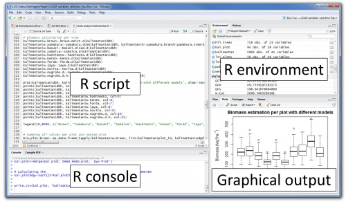

# Overview

```{r, results='hide', echo=FALSE}
knitr::opts_chunk$set(results = 'hold')
```

```{r, echo = F, message=FALSE, results = 'hide'}
library(tidyverse)
```

### What are we doing here?

  This is a quick and dirty introduction to data analysis in R. The goals are
  to:
  
  * introduce how to analyze data in R 
  * introduce how to visualize data in R

  It is **not** anything resembling a course on statistics and data science. 
  
  I am a petty dictator, and have added some goals about things I care about:
  
  * learn how to interpret a regression model
  * learn why quantative social scientists answer questions they way they do


### Why sharks?


### A representative article

[](https://www.vox.com/policy-and-politics/2017/6/1/15515820/donald-trump-democracy-brexit-2016-election-europe)

### A quote from said article

> Consider the curious case of New Jersey in 1916: That summer, there was a 
> string of deadly shark attacks along the Jersey Shore. As a result, Woodrow 
> Wilson lost his home state in the presidential election.

> Why, you ask? Because the beachfront towns (which rely on tourism) were 
> negatively impacted by the attacks. Though Wilson wasn’t responsible for the 
> hungry sharks, he was the incumbent, and people vote against incumbents when things are bad. 
  

### *Democracy for Realists*


### The Discourse I


### The Discourse II


### The Discourse III


### The Discourse IV


### Why R?

* **Pragmatism**. It's another thing you can put on your resume.
* **Interdisciplinarity**. Social scientists love R.
* **Data cleaning**. The tidyverse provides a consistent and friendly
    interface for data cleaning and munging.
* **Visualization**. ggplot2 is R's killer app.
*  **Libraries**. Living at the cutting edge of statistical modeling?
    You're probably going to want to know some R.

### Preliminaries

I gave a similar but drier tutorial last year; a copy of that document is
[here](https://sdmccabe.github.io/r_tutorial_f19/resources/bootcamp_r_f17.html).
If you have questions about R's bizarre and terrible type system, or why there
are so many `<-`s littered throughout the code, check it out.

### Preliminaries: Libraries
  You're going to want the following libraries (hopefully already installed):

* ggplot2
* dplyr and tidyr
* readr and haven
* devtools

The `tidyverse` meta-package provides all the needed libraries, except for devtools.

### Preliminaries: RStudio
RStudio is *the* IDE for R. Accept no substitutes.

### Preliminaries: RStudio
[](http://wiki.awf.forst.uni-goettingen.de/wiki/index.php/Installation_and_Interface_of_R)

### Preliminaries: A quick R-Python Rosetta Stone

|                        | R                      | Python                              |
|------------------------|------------------------|-------------------------------------|
| Assignment             | `<-`                   | `=`                                 |
| Import (i)             | `library(x)`           | `from x import *`                   |
| Import (ii)            | N/A                    | `import x`                          |
| Calling Libraries (i)  | `library(lib); func()` | `from lib import func; func()`      |
| Calling Libraries (ii) | `lib::func()`          | `import lib; lib.func()`            |
| Concetenation          | `c(x, y)`              | `[x] + [y]`                         |
| String Concatenation   | `paste('x', 'y')`      | `'x' + ' y'`                        |
| Pipes                  | `x %>% f(y)`           | `f(x, y)`                           |
| Conditionals           | `ifelse(cond, 1, 2)`   | `if cond: 1; else: 2`               |
| Package Installation   | `install.packages(x)`  | `pip install x`                     |
| Vectorized Math        | `c(1, 2) + c(1, 2)`    | `np.array([1,2]) + np.array([1,2])` |
|                        |                        |                                     |                 

# Getting the data

### Locating the data

The data is taken from Fowler and Hall's [critique of an earlier paper on shark attacks](https://www.journals.uchicago.edu/doi/abs/10.1086/699244). I've 
converted their Stata files to CSV for convenience; they're on the tutorial website. 

### `readr`

To load a data file, `readr` provides a consistent interface across formats 
(and if `readr` can't load it, try `haven`). Thus, we'll use the library's 
`read_csv` function instead of base R's `read.csv`. 

(Note that `.` is valid in function and variable names in R; that is, `read.csv`
is **not** a method of a class `read`.)

### Loading the sharks data

```{r}
# sharks <- read_csv("~/git/r_tutorial_f19/resources/shark.csv")
sharks <- read_csv("https://sdmccabe.github.io/r_tutorial_f19/resources/shark.csv")
```

Note that `read_csv` treats URLs and file paths the same when reading in a file.
Storing a local copy of a file is almost always preferable, but using URLs can
be convenient in some cases (like this one).

### Examining the sharks data

```{r}
dim(sharks)
head(sharks)
```
So, we have a data frame containing 21 observations of 8 attributes. 

### The columns

* **county**: the name of a county in New Jersey
* **wilson1912**: Woodrow Wilson's (three-party) share of the vote in 1912
* **wilson1916**: Woodrow Wilson's (two-party) share of the vote in 1916
* **beach**: does the county have substantial beach-related tourism?
* **machine**: were the politics of this county run by a political machine?
* **mayhew**: an alternative specification of machine
* **attack**: was there a shark attack in this county?
* **coastal**: is the county located on the coast?

### The columns, visualized

```{r, echo = F, message=F, warning=F}
library(sf)
nj <- read_sf("~/Downloads/shape/New_Jersey_Counties.shp")
nj <- nj %>% left_join(sharks, by = c("COUNTY" = "county"))
tidy_nj <- nj %>% mutate(change = wilson1916-wilson1912) %>% gather("var", "val", wilson1912:change)
```

```{r, echo = F}
p1 <- ggplot() + 
  geom_sf(data = nj, aes(fill = wilson1912)) + 
  coord_sf(ndiscr = 0) + 
  scale_fill_continuous() + 
  labs(title = "wilson1912") +
  theme(legend.position = "none")
```

```{r, echo = F}
p2 <- ggplot() + 
  geom_sf(data = nj, aes(fill = wilson1916)) + 
  coord_sf(ndiscr = 0) + 
  scale_fill_continuous() + 
  labs(title = "wilson1916") +
  theme(legend.position = "none")
```

```{r, echo = F}
p3 <- ggplot() + 
  geom_sf(data = nj, aes(fill = wilson1916 - wilson1912)) + 
  coord_sf(ndiscr = 0) + 
  scale_fill_gradient2(low = "firebrick",
                       mid = "lightgray",
                       high = "midnightblue") + 
  labs(title = "change") +
  theme(legend.position = "none")
```

```{r, echo = F}
p4 <- ggplot() + 
  geom_sf(data = nj, aes(fill = as.factor(attack))) + 
  coord_sf(ndiscr = 0) + 
  scale_fill_discrete() + 
  labs(title = "attack") +
  theme(legend.position = "none")
```

```{r, echo = F}
p5 <- ggplot() + 
  geom_sf(data = nj, aes(fill = as.factor(beach))) + 
  coord_sf(ndiscr = 0) + 
  scale_fill_discrete() + 
  labs(title = "beach") +
  theme(legend.position = "none")
```

```{r, echo = F}
p6 <- ggplot() + 
  geom_sf(data = nj, aes(fill = as.factor(coastal))) + 
  coord_sf(ndiscr = 0) + 
  scale_fill_discrete() + 
  labs(title = "coastal") +
  theme(legend.position = "none")
```

```{r, echo = F}
p7 <- ggplot() + 
  geom_sf(data = nj, aes(fill = as.factor(machine))) + 
  coord_sf(ndiscr = 0) + 
  scale_fill_discrete() + 
  labs(title = "machine") +
  theme(legend.position = "none")
```

```{r, echo = F}
p8 <- ggplot() + 
  geom_sf(data = nj, aes(fill = as.factor(mayhew))) + 
  coord_sf(ndiscr = 0) + 
  scale_fill_discrete() + 
  labs(title = "mayhew") +
  theme(legend.position = "none")
```

```{r, echo = F}
gridExtra::grid.arrange(p1,p2,p3,p4,
                        p5,p6,p7,p8,
                        ncol = 4)
```

### Indexing with `$`

Columns of a data frame are indexed with the `$` operator, so we can pull out 
a single column like so:
```{r}
sum(sharks$beach)
```

There are four beach counties in New Jersey.

### Numeric indexing I

We can also use numeric indices to pull out rows or columns:

```{r}
head(sharks[,4]) # column indexing
```
### Numeric indexing II

```{r}
sharks[1:4,] # row indexing, plus showing 1:4 to generate a 
             # sequence from 1 to 4
```

This can be handy for quick and dirty operations but is less explicit than
the `$` operator. Note also that **R is one-indexed**.

# Analyzing the data: Summary statistics

### Summary statistics

R has most univariate and bivariate summary statistics built in, so they can
be acessed rather simply:

```{r}
mean(sharks$wilson1912)
cor(sharks$wilson1912, sharks$wilson1916)
```

### The `summary()` function

A particularly useful function here is `summary`, which can be applied across
an entire data frame:

```{r}
summary(sharks)
```

# Visualizing the data

### A cautionary tale I
Summary statistics are helpful but are no substitute for a visual understanding
of a dataset. To illustrate, consider
[Anscombe's Quartet](https://en.wikipedia.org/wiki/Anscombe%27s_quartet). 

```{r}
anscombe <- datasets::anscombe # anscombe should already be in your namespace
                               # but this makes it explicit
                               # note that :: pulls something from a library
                               # compare to, say, the . in np.zeros()
```

### A cautionary tale II

```{r}
anscombe
```

### Anscombe's summary statistics

```{r}
round(map_dbl(anscombe[,5:8], mean), 3)
round(map_dbl(anscombe[,5:8], sd), 3)
round(map2_dbl(anscombe[,1:4], anscombe[,5:8], cor), 3)
```

These summary statistics are quite similar...

### Anscombe visualized I

```{r, echo = TRUE, eval=FALSE}
a1 <- qplot(anscombe$x1, anscombe$y1)
a2 <- qplot(anscombe$x2, anscombe$y2)
a3 <- qplot(anscombe$x3, anscombe$y3)
a4 <- qplot(anscombe$x4, anscombe$y4)
gridExtra::grid.arrange(a1, a2, a3, a4)
```
### Anscombe visualized II

```{r, echo = FALSE, eval=TRUE, fig.width=6, fig.height=3}
a1 <- qplot(anscombe$x1, anscombe$y1)
a2 <- qplot(anscombe$x2, anscombe$y2)
a3 <- qplot(anscombe$x3, anscombe$y3)
a4 <- qplot(anscombe$x4, anscombe$y4)
gridExtra::grid.arrange(a1, a2, a3, a4)
```

### Anscombe visualized III

... but the underlying data are quite different. Data visualization is your
friend, and one of R's strengths.

### `ggplot` versus "base R"

I'm deliberately omitting discussion of so-called "base R" plotting---although
it is frequently useful---in favor of emphasizing `ggplot2`'s feature set. The
analogy is slightly inapt, but think of `ggplot2` as playing a similar role
relative to base R graphics as `seaborn` plays to `matplotlib`. 

I provided some discussion of base R plotting in 2017's tutorial, so,
again, check it out [here](https://sdmccabe.github.io/r_tutorial_f19/resources/bootcamp_r_f17.html).

### The structure of a `ggplot()` call

Although simple plots---scatter plots and histograms, mostly---can be generated 
with the `qplot` function, most of the useful visualization features require 
wrapping your mind around `ggplot` and its associated functions. The goal of 
`ggplot2` is to implement a consistent *grammar of graphics*, and to that end 
most visualizations will have the same core elements:

* a **data** frame; that is, you want to have well-structured data ahead of time
* an **aes**thetic mapping telling R which columns to include, what your x-axis is, etc.
* various **geom** or **stat** functions to turn the mapped data into visualizations

This sounds intimidating at first, but is relatively straightforward in 
practice. We already have the data, so once we figure out our mappings and 
geoms, we can make some plots.

### Histograms I

What about a histogram of Wilson's 1912 vote share?

```{r, echo = T, eval = F}
ggplot(data = sharks, mapping = aes(x = wilson1912)) +
  geom_histogram()
```

### Histograms II

```{r, echo = F, eval = T, message=F, fig.height=4, fig.width=8}
ggplot(data = sharks, mapping = aes(x = wilson1912)) +
  geom_histogram()
```

### Fancier histograms I

Not so bad. Similarly to how, with `matplotlib`, we might build up a plot with 
multiple method calls, here we chain function calls with the `+` operator. So 
we can make the histogram slightly nicer:

```{r, eval = F, echo = T}
ggplot(sharks, aes(x = wilson1912)) + 
  geom_histogram(binwidth = 0.01) +
  theme_bw() +
  labs(x = "Wilson 1912 Vote Share",
       y = "Count",
       title = "A Nicer Histogram")
```

### Fancier histograms II

```{r, eval = T, echo = F}
ggplot(sharks, aes(x = wilson1912)) + 
  geom_histogram(binwidth = 0.01) +
  theme_bw() +
  labs(x = "Wilson 1912 Vote Share",
       y = "Count",
       title = "A Nicer Histogram")
```

### Bivariate `geom`s 

We can also use `geom`s like `geom_point` or `geom_smooth` to plot a bivariate 
relationship, like that between Wilson's 1912 and 1916 vote shares. How 
consistent are election returns from cycle to cycle?

```{r, echo = T, eval = F}
ggplot(sharks, aes(x = wilson1912, y = wilson1916)) + 
  geom_point() +
  geom_smooth(method = "lm") + 
  theme_bw() + 
  labs(x = "Wilson 1912",
       y = "Wilson 1916")
```


Here we are using two `geom`s in one plot; there's no limitation (except 
pragmatic ones) on the number you can use. So we used `geom_point` to draw a 
scatter plot and then `geom_smooth` to fit a straight line summarizing those 
data points (the additional parameter `method = "lm"` indicates to use a 
linear model instead of the potentially nonlinear method used by default).

### Bivariate `geom`s II

```{r, echo = F, eval = T}
ggplot(sharks, aes(x = wilson1912, y = wilson1916)) + 
  geom_point() +
  geom_smooth(method = "lm") + 
  theme_bw() + 
  labs(x = "Wilson 1912",
       y = "Wilson 1916")
```

### A more complicated example I

Another way to look at this is to go county-by-county and compare.

```{r, echo = T, eval = F}
ggplot(sharks, aes(y = county, color = (beach == 1))) + 
  geom_point(aes(x = wilson1912)) + # solid point
  geom_point(aes(x = wilson1916), shape = 1) + # hollow point 
  labs(x = "Vote Share", 
       y = "County",
       color = "Beach County?") + 
  theme_minimal()
```

### A more complicated example II

```{r, eval = T, echo = F}
ggplot(sharks, aes(y = county, color = (beach == 1))) + 
  geom_point(aes(x = wilson1912)) + # solid point
  geom_point(aes(x = wilson1916), shape = 1) + # hollow point 
  labs(x = "Vote Share", 
       y = "County",
       color = "Beach County?") + 
  theme_minimal()
```

### A more complicated example III

```{r, echo = T, eval = F}
ggplot(sharks, aes(y = county, color = (beach == 1))) + 
  geom_point(aes(x = wilson1912)) + # solid point
  geom_point(aes(x = wilson1916), shape = 1) + # hollow point 
  labs(x = "Vote Share", 
       y = "County",
       color = "Beach County?") + 
  theme_minimal()
```

Aside from showing how easy it is to build up useful visualizations, this also 
starts to give us some substantive insight: all of the beach counties saw 
either no change or a decrease in Wilson vote share; no beach county saw a 
meainingful increase in Wilson support. That's interesting, at least, and 
some (weak) evidence for the claim that voters punished Wilson for the 
shark attacks.

# Analyzing the data: Regression

### Statistical models

What is a statistical model? 

1. a probability model ($Y_i = \beta_0 + \beta_1 x_i + \varepsilon_i$)
2. a sampling model (independent samples from an infinite population)
3. a statistical generating mechanism (the error term is normally distributed)

### Regression

[](https://www.kdnuggets.com/2016/04/regression-correlation-military-tutorial.html/2)

### Regression

[](https://stats.libretexts.org/Textbook_Maps/Introductory_Statistics/Book%3A_Introductory_Statistics_(Shafer_and_Zhang)/10%3A_Correlation_and_Regression/10.3%3A_Modelling_Linear_Relationships_with_Randomness_Present)

### An introduction to formula syntax {.allowframebreaks}

Most statistical modeling functions in R use some variant of *formula syntax*:

```{r, eval = F}
Y ~ X
```

Often, `X` will include multiple variables of interest, and potentially 
transformations of those variables or interactions bewteen variables. 

```{r, eval = F}
Y ~ X1 + X2 + X1:X2 + I(X1^2) # transformations are nested in I()
Y ~ X1*X2 + I(X1^2) # this expresses the same equation
Y ~ X1*X2 + I(X1^2) - 1 # as above, but drop the intercept term
```

So, applying this to our example, we might want to regress Wilson's 1916 vote 
share on his 1912 vote share and see how much of the variance is explained by a 
simple **l**inear **m**odel.

```{r}
m <- lm(wilson1916 ~ wilson1912, data = sharks)
```


```{r, size='tiny'}
summary(m)
```

```{r, echo=F, message=F, results=F}
library(stargazer)
```

```{r, results='asis'}
stargazer(m, header = F, font.size = 'scriptsize')
```

```{r}
broom::tidy(m) %>%
  ggplot(aes(x = term)) + 
  geom_point(aes(y = estimate)) + 
  geom_errorbar(aes(ymin = estimate - 1.96 * std.error,
                    ymax = estimate + 1.96 * std.error),
                width = 0.1) + 
  geom_hline(aes(yintercept = 0), 
             linetype = 'dashed') + 
  coord_flip() + 
  theme_minimal()
```

### An exercise: build your own shark attack model!

So, with all this in hand, we can start doing the sort of 
research that gets our name in Vox.

Ask yourself:

* What is the outcome of interest?
* What variables are appropriate to include?
* What would qualify as a substantively meaningful result?
* What is the interpretation of each of your coefficients?

### The columns, visualized

```{r, echo = F}
gridExtra::grid.arrange(p1,p2,p3,p4,
                        p5,p6,p7,p8,
                        ncol = 4)
```

### Achen and Bartels's model {.allowframebreaks}

```{r}
ab_sharks <- sharks[-7,] 
dim(ab_sharks)
ab_model <- lm(wilson1916 ~ wilson1912 + machine + beach, data = ab_sharks)
summary(ab_model)
```

# Resources

### References on shark attacks {.allowframebreaks}

Shark attacks were a big story on Political Science Twitter in summer 2018. 

- [*Democracy for Realists* (Achen and Bartels 2016)](https://www.amazon.com/Democracy-Realists-Elections-Responsive-Government/dp/0691178240) is the canonical reference for the original shark attack claim, though it was first presented at a conference over a decade earlier.
- [Fowler and Hall (2018a)](https://www.journals.uchicago.edu/doi/abs/10.1086/699244) present a critique of the result; the data used here is drawn from their critique.
- [Achen and Bartels (2018)](https://www.journals.uchicago.edu/doi/abs/10.1086/699245) is a response to the critique.
- [Fowler and Hall (2018b)](https://drive.google.com/file/d/1XYvjNgJWMaRS8v-O2X7Cy72zeeeH4xSS/view) get the last word. (For now, at least.)
- [Lenz (2018)](https://www.tandfonline.com/doi/abs/10.1080/08913811.2018.1470859) wonders if this has been a good use of anyone's time.

### References on R {.allowframebreaks}

#### Cheat sheets
The RStudio website has some terrific cheat sheets that I encourage everyone to 
bookmark (especially the data wrangling one, which I have to reference every 
time I use tidyr):

- [Base R](http://github.com/rstudio/cheatsheets/raw/master/base-r.pdf)
- [ggplot2](https://github.com/rstudio/cheatsheets/raw/master/data-visualization-2.1.pdf)
- [RMarkdown](https://github.com/rstudio/cheatsheets/raw/master/rmarkdown-2.0.pdf)
- [RStudio IDE](https://github.com/rstudio/cheatsheets/raw/master/rstudio-ide.pdf)
- [Data Transformation](https://github.com/rstudio/cheatsheets/raw/master/data-transformation.pdf)

#### Working in R
If you're doing large-scale work in R, especially involving package development, 
here are some useful sources on development and R internals:

- The companion website to Wickham's [Advanced R](http://adv-r.had.co.nz/) book.
- The companion website to Wickham's [R Packages](http://r-pkgs.had.co.nz/) book.

#### Visualization
- [Healy (2017) - Data Visualization: A Practical Introduction](https://socviz.co/)
- [Ognyanova (2018) - Static and dynamic network visualization with R](http://kateto.net/network-visualization)

#### Workflow
Some good resources on structuring and approaching a data analysis project:

- **[Healy (2016) - The Plain Person’s Guide to Plain Text Social Science](http://plain-text.co/)**
- [Wilson et al (2017) - Good enough practices in scientific computing](http://journals.plos.org/ploscompbiol/article?id=10.1371/journal.pcbi.1005510)
- [Wickham (2014) - Tidy data](http://vita.had.co.nz/papers/tidy-data.pdf)
- [Leek (2015) - The elements of data analytic style](https://leanpub.com/datastyle)
- [The tidyverse style guide](http://style.tidyverse.org/index.html)

#### Networks in R
Katya Ognyanova, one of David's former postdocs, has a 
good [introduction to network analysis in R](http://kateto.net/networks-r-igraph) 
with `igraph`. 

# Appendix

### Code for NJ plots {.allowframebreaks}

```{r, eval = F, message=F, warning=F}
library(sf)
nj <- read_sf("~/Downloads/shape/New_Jersey_Counties.shp")
nj <- nj %>% left_join(sharks, by = c("COUNTY" = "county"))
```

```{r, eval = F}
p1 <- ggplot() + 
  geom_sf(data = nj, aes(fill = wilson1912)) + 
  coord_sf(ndiscr = 0) + 
  scale_fill_continuous() + 
  labs(title = "wilson1912") +
  theme(legend.position = "none")
```

```{r, eval = F}
p2 <- ggplot() + 
  geom_sf(data = nj, aes(fill = wilson1916)) + 
  coord_sf(ndiscr = 0) + 
  scale_fill_continuous() + 
  labs(title = "wilson1916") +
  theme(legend.position = "none")
```

```{r, eval = F}
p3 <- ggplot() + 
  geom_sf(data = nj, aes(fill = wilson1916 - wilson1912)) + 
  coord_sf(ndiscr = 0) + 
  scale_fill_gradient2(low = "firebrick",
                       mid = "lightgray",
                       high = "midnightblue") + 
  labs(title = "change") +
  theme(legend.position = "none")
```

```{r, eval = F}
p4 <- ggplot() + 
  geom_sf(data = nj, aes(fill = as.factor(attack))) + 
  coord_sf(ndiscr = 0) + 
  scale_fill_discrete() + 
  labs(title = "attack") +
  theme(legend.position = "none")
```

```{r, eval = F}
p5 <- ggplot() + 
  geom_sf(data = nj, aes(fill = as.factor(beach))) + 
  coord_sf(ndiscr = 0) + 
  scale_fill_discrete() + 
  labs(title = "beach") +
  theme(legend.position = "none")
```

```{r, echo = F}
p6 <- ggplot() + 
  geom_sf(data = nj, aes(fill = as.factor(coastal))) + 
  coord_sf(ndiscr = 0) + 
  scale_fill_discrete() + 
  labs(title = "coastal") +
  theme(legend.position = "none")
```

```{r, eval = F}
p7 <- ggplot() + 
  geom_sf(data = nj, aes(fill = as.factor(machine))) + 
  coord_sf(ndiscr = 0) + 
  scale_fill_discrete() + 
  labs(title = "machine") +
  theme(legend.position = "none")
```

```{r, eval = F}
p8 <- ggplot() + 
  geom_sf(data = nj, aes(fill = as.factor(mayhew))) + 
  coord_sf(ndiscr = 0) + 
  scale_fill_discrete() + 
  labs(title = "mayhew") +
  theme(legend.position = "none")
```

```{r, eval = F}
gridExtra::grid.arrange(p1,p2,p3,p4,
                        p5,p6,p7,p8,
                        ncol = 4)
```

### Okay, but how do I do all this in Python? {.allowframebreaks}

```{r, echo = F}
library(reticulate)
#reticulate::use_condaenv("base")
reticulate::use_python("~/.pyenv/shims/python")
```

```{python}
import pandas as pd
import matplotlib.pyplot as plt
import numpy as np
import statsmodels.api as sm
import statsmodels.formula.api as smf
import seaborn as sns
```

```{python}
py_sharks = pd.read_csv("https://sdmccabe.github.io/r_tutorial_f19/resources/shark.csv")
py_ab_sharks = py_sharks.drop(py_sharks.index[6])
py_m = smf.  \
  ols("wilson1916 ~ wilson1912 + machine + beach", data = py_ab_sharks).  \
  fit()
print(py_m.summary())
```

```{python}
fig, ax = plt.subplots()
py_sharks.hist('wilson1912', bins = np.arange(0.3, 0.6, 0.01), ax = ax)
plt.show()
```


```{python}
fig2, ax2 = plt.subplots()
sns.regplot(py_sharks['wilson1912'], py_sharks['wilson1916'], ax = ax2)
plt.show()
```

```{python}
fig3, ax3 = plt.subplots()
sns.pointplot(y=py_sharks['county'], x=py_sharks['wilson1912'], 
  hue = py_sharks['beach'], linestyles=' ', markers = 'o')
sns.pointplot(y=py_sharks['county'], x=py_sharks['wilson1916'], 
  hue = py_sharks['beach'], linestyles=' ', markers = 'x')

plt.show()
```

I guess that made Python look simpler than R...
